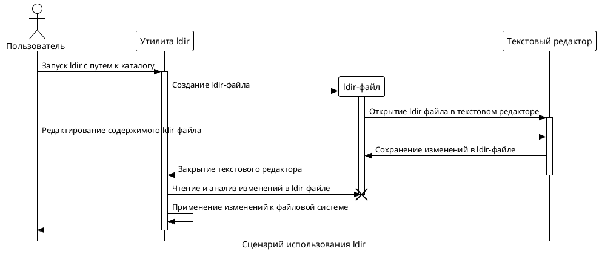
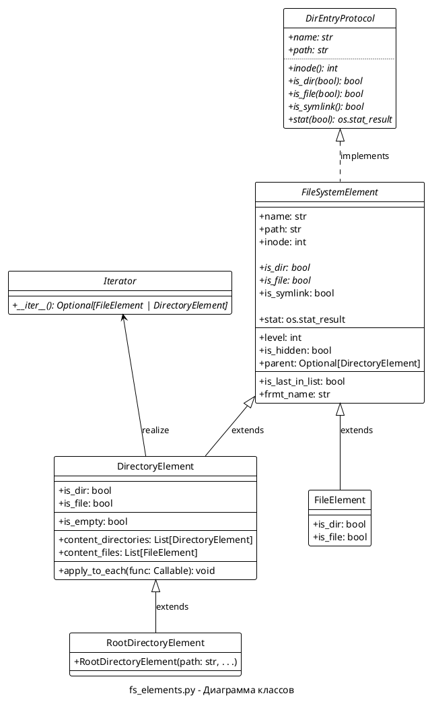
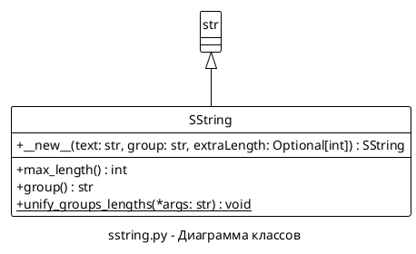

# Конспект проекта "ldir"

Проект **ldir** - это утилита командной строки для *nix, предназначенная для удобного редактирования большого количества файлов и каталогов.

Эта утилита позволяет редактировать содержимое каталога в текстовом редакторе.

Используя утилиту **ldir** можно:

* _добавлять_
* _удалять_
* _переименовывать_
* _копировать_
* _перемещать_

а также изменять некоторые атрибуты файлов и каталогов:

* _права доступа_
* _владельца и группу_
* _редактировать символьные ссылки_

используя практически любой текстовый редактор.

## ТЕРМИНОЛОГИЯ

*Редактор* - текстовый редактор, который открывается приложением ldir для редактирования файла.

*Список элементов* - список файлов и, возможно, директорий, с которыми пользователь планирует произвести операции.

*ldir-файл* - файл, который открывается в Редакторе и содержит Список элементов для изменения.

*Обрабатываемая директория* - Это существующая директория в файловой системе, элементы которой будут обрабатываться утилитой.


## Язык программирования

Для реализации утилиты "ldir" выбран язык программирования Python.

## Как работает ldir:

При запуске **ldir** он открывает указанный каталог в вашем текстовом редакторе.

Каждая строка в редакторе представляет файл или директорию. Вы можете редактировать эти строки как обычный текст.

После того как вы завершите редактирование и сохраните изменения, **ldir** применит их к файловой системе.



### Примерный сценарий использования:
1. Открытие Редактора: При вызове ldir, утилита открывает ldir-файл в выбранном текстовом редакторе.
2. Редактирование Файла: Пользователь редактирует файл, следуя определенным правилам для указания операций над файлами и каталогами.
3. Анализ Изменений: После сохранения и закрытия файла, утилита анализирует внесенные изменения и выполняет соответствующие действия в файловой системе.

## ТРЕБОВАНИЯ И ФУНКЦИОНАЛЬНОСТЬ

- [ ] Утилита должна быть написана на языке Python и работать на *nix системах.
- [x] Поддерживаемые версии Python: 3.8 и выше.
- [x] Утилита должна принимать путь к каталогу в качестве аргумента командной строки.
- [ ] Утилита должна открывать содержимое указанного каталога в текстовом редакторе пользователя.
    - [x] Интеграция с текстовым редактором.
    - [ ] Формат ldir-файла.
- [x] Каждый файл или директория в каталоге должны представляться отдельной строкой в текстовом редакторе.
- [ ] Пользователь должен иметь возможность редактировать эти строки для выполнения следующих действий:
    - [ ] Добавление новых файлов или директорий
    - [ ] Удаление существующих файлов или директорий
    - [ ] Переименование файлов или директорий
    - [ ] Копирование файлов или директорий
    - [ ] Перемещение файлов или директорий
- [ ] Пользователь должен иметь возможность изменять следующие атрибуты файлов и директорий:
    - [ ] Права доступа
    - [ ] Владельца и группу
    - [ ] Символьные ссылки
- [ ] Анализ изменений
- [ ] После сохранения изменений в текстовом редакторе, утилита должна применить эти изменения к файловой системе.
- [ ] Безопасность.
- [ ] Утилита должна обрабатывать ошибки и предоставлять информативные сообщения об ошибках.
- [ ] Утилита должна иметь документацию, включающую инструкции по установке и использованию.

## ПАРАМЕТРЫ ЗАПУСКА:

```
ldir [options] <directory>

  --help        -h      Выводит краткую справку.
  --editor      -e      Редактор.
  --editor-args -g      Параметры запуска редактора.
  --recursive   -r [N]  Флаг, рекурсивно обрабатывать подкаталоги (False). Если 
                          указано число, то обрабатывать до указанной глубины:
                          N<0 -- обработать на всю глубину (поведение по умолчанию если флаг указан без N).
                          N=0 -- только текущая директория (поведение по умолчанию если флаг не указан).
                          N>0 -- обработать до глубины N.
  --directory   -d      Флаг, обрабатывать поддиректории (False).
  --hidden      -a      Флаг, показывать скрытые файлы (False).
```


-----

# ТЕКУЩЕЕ СОСТОЯНИЕ

## ИНТЕГРАЦИЯ С ТЕКСТОВЫМ РЕДАКТОРОМ

- [x] интеграция с текстовым редактором

### Алгоритм выбора редактора:

1. Проверить, был ли указан параметр `--editor` при запуске утилиты. Если да, использовать указанный редактор.

2. Если параметр `--editor` не был указан, проверить, запущено ли приложение в сеансе X. Если да, перейти к следующему шагу. Если нет, пропустить следующий шаг.

3. Проверить, установлена ли переменная среды `VISUAL`. Если да, использовать редактор, указанный в этой переменной. Если нет, перейти к следующему шагу.

4. Проверить, установлена ли переменная среды `EDITOR`. Если да, использовать редактор, указанный в этой переменной. Если нет, перейти к следующему шагу.

5. Использовать первый из доступных редакторов в следующем порядке: `mcedit`, `nano`, `vim`, `vi`.

6. Если ни один из этих шагов не приводит к выбору редактора, то возникает ошибка, так как редактор необходим для работы утилиты `ldir`.


## `entity.py`:
**FIXME: актуализировать**

Модуль `fs_elements.py` содержит реализацию классов для работы с элементами файловой системы.




**`DirEntryProtocol`**:
Интерфейс, определяющий структуру для работы с объектами, аналогичными os.DirEntry. Описывает обязательные методы и свойства: `path`, `inode`, `is_dir`, `is_file`, `is_symlink`, и `stat`, которые должны быть реализованы в классах, следующих этому протоколу.

**`FileSystemElement`**:
Абстрактный класс, реализующий `DirEntryProtocol`. Представляет собой базовый элемент файловой системы, добавляя дополнительные свойства и методы, такие как уровень вложенности `level` и флаг скрытости `is_hidden`. Определяет абстрактные методы `is_dir` и `is_file`, которые необходимо реализовать в конкретных подклассах.

**`FileElement`**:
Конкретная реализация `FileSystemElement` описывающая фай.

**`DirectoryElement`**:
Конкретная реализация `FileSystemElement` описывающая директорию. В дополнение к базовым свойствам и методам. Метод для обхода дерева -- `apply_to_each`, и метод для тестовой печати содержимого дерева `print_content`.

Класс, также, реализует интерфейс `Iterator` для обхода дерева (например в цикле `for in`).

**`RootDirectoryElement`**:
Специализированная реализация `DirectoryElement`, предназначенная для представления корневой директории. Включает в себя дополнительную логику инициализации.

Эти классы образуют основу модуля для взаимодействия с элементами файловой системы, позволяя получать информацию о файлах и директориях, а также обходить файловую систему и выводить ее содержимое.

### Пример использования:

```python
from fs_elements import FileSystemElement, RootDirectoryElement

config = {
    'recursive': True,
    'subdirectories': True,
    'hidden': False
}
root = RootDirectoryElement("/path/to/directory", **config)

root.print_content() # Вывод содержимого директории

# перебор всех элементов дерева и печать имени и пути
root.apply_to_each(lambda x: print(x.name, x.path))

for e in root:
    if e is not None:
        print("file" if e.is_file else " dir", e.name)

```

### TODO

- [x] Вдумчиво проанализировать иерархию наследования. Возможные проблемы включают в себя конфликты имен и сложности с разрешением методов.

- [ ] Рекурсия. Обрабатывать символические ссылки с особой осторожностью, чтобы избежать зацикливания, и рассмотреть возможность использования итеративных методов обхода.

- [?] Если у пользователя нет прав доступа для изменения элемента то заменять `inode` такого элемента значением `'#' * innode.max_length`. Таким образом элемент будет появляться в ldir-файле, но не будет обрабатываться.

- [ ] Рассмотреть обработку потенциальных исключений (например, `FileNotFoundError` при работе с символическими ссылками, указывающими на несуществующие файлы).

- [ ] Свойство `extension` должно корректно обрабатывать файлы с двойными (тройными?) расширениями. Функция `os.path.splitext` будет обрабатывать только последнюю часть расширения, что видно на примере `example.tar.gz`. Это важно учитывать при работе с файлами, имеющими несколько расширений.


## `sstring.py`

